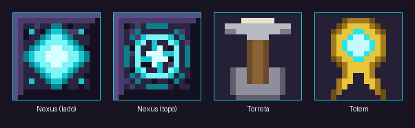
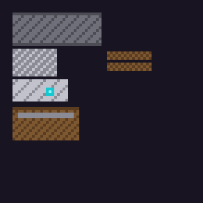

<div align="center">

# 🛡️ Defend The Block

**Coloque o Nexus. Sobreviva a todas as noites.**
**Se ele cair, o mundo acaba — literalmente.**

[](#-versoes-compativeis)
[](https://fabricmc.net/)
[](LICENSE)

**Português (Brasil)** · [English](README.en.md)

</div>

> 🖼️ **`docs/images/hero.png`** — imagem de capa: o Nexus brilhando no centro de
> uma base cercada de torretas, com a horda chegando ao fundo durante a noite.
> Formato paisagem, ~1280x480.

---

## 📖 Indice

| | |
|---|---|
| [🎯 O que e este mod](#-o-que-e-este-mod) | [🏗️ O que voce constroi](#️-o-que-voce-constroi) |
| [🎮 Versoes compativeis](#-versoes-compativeis) | [🧟 O que vem atras de voce](#-o-que-vem-atras-de-voce) |
| [📥 Instalacao](#-instalacao) | [📊 HUD e comandos](#-hud-e-comandos) |
| [⚠️ Antes de jogar: leia isto](#️-antes-de-jogar-leia-isto) | [⚙️ Configuracao](#️-configuracao) |
| [🚀 Primeiros passos](#-primeiros-passos) | [🔧 Compilando do codigo](#-compilando-do-codigo) |

---

## 🎯 O que e este mod

**Defend The Block** transforma o Minecraft num modo de sobrevivencia por ondas,
sem tirar voce do mundo aberto de sempre.

Voce fabrica e coloca um bloco — o **Nexus**. A partir daquele momento, **toda
noite** uma horda de mobs hostis nasce ao redor e marcha ate ele com um unico
objetivo: destrui-lo. Eles nao sao os mobs burros de sempre. Eles **cavam** a
sua parede, **explodem** o que trava a passagem, **montam escadas** para subir
no que voce construiu e **constroem pontes** se voce esconder o Nexus no alto.

Voce tem os dias para se preparar: erguer muros, cavar fossos, posicionar
**torretas de flechas** automaticas e personaliza-las. E tem as noites para
segurar a linha.

Se o Nexus cair, **o mod apaga a pasta do mundo**. Nao ha segunda chance —
embora isso seja desligavel na config, se voce preferir so a mensagem de derrota.

### ✨ O que ele oferece

| | Recurso |
|---|---|
| 🔷 | **O Nexus** — um bloco indestrutivel que so os invasores ferem. Colocou, nao sai mais. |
| 🌙 | **Invasao toda noite**, sem numero fixo de mobs: enquanto a noite durar, morreu um, nasce outro. |
| 📈 | **Dificuldade que cresce de verdade** — mais mobs vivos, mais vida, mais dano, melhor equipamento. |
| 🏹 | **Torreta de flechas** automatica, com 5 niveis de material. |
| 📚 | **9 modulos de torreta** para personalizar atributos — mas so 2 por torreta. |
| 🧠 | **IA de cerco**: minerar, explodir, escalar, construir ponte, arrombar porta, atear fogo. |
| 🛡️ | **Emparedar o Nexus funciona** — cobertura de verdade bloqueia o dano. |
| 🕐 | **3 dias de carencia** antes da primeira invasao, com aviso na tela. |
| 🧹 | **O terreno volta ao normal** ao amanhecer: o entulho que a horda construiu some. |
| 💎 | **Saque** espalhado em volta do Nexus a cada noite sobrevivida. |
| ⚙️ | **64 opcoes de configuracao** — da vida do Nexus a cada chance de habilidade. |

---

## 🎮 Versoes compativeis

| Minecraft | Mod Loader | Java | Status |
|---|---|---|---|
| **1.20.1** | Fabric Loader + Fabric API | 17+ | ✅ Suportado |
| **1.21.1** | Fabric Loader + Fabric API | 21+ | ✅ Suportado |

O mesmo codigo roda nas duas versoes. Cada uma tem o seu proprio jar — baixe o
que corresponde a sua instalacao.

> ℹ️ **Limitacao conhecida no 1.21:** os encantamentos **Impacto** e
> **Perfuracao** aplicados na torreta ficam sem efeito, porque o 1.20.5 passou a
> deriva-los do item da arma que disparou. Os outros quatro (Poder, Chama,
> Multitiro, Carga Rapida) funcionam normalmente, e no 1.20.1 os seis funcionam.
> Os **modulos do mod nao sao afetados** por isso.

---

## 📥 Instalacao

1. Instale o **[Fabric Loader](https://fabricmc.net/use/)** para 1.20.1 ou 1.21.1.
2. Baixe a **[Fabric API](https://modrinth.com/mod/fabric-api)** da versao correspondente.
3. Coloque os dois jars (Fabric API + Defend The Block) na pasta `mods/`.
4. Inicie o jogo. Na primeira execucao o mod cria `config/defendtheblock.json`.

Serve tanto para **um jogador** quanto para **servidor dedicado**.

---

## ⚠️ Antes de jogar: leia isto

<table>
<tr><td>

### 💀 O mod apaga o seu save

Quando o Nexus cai, o mod desconecta todos os jogadores, desliga o servidor e
**apaga a pasta do mundo**. E o game over do desafio, e e **irreversivel**.

Para ficar so com a mensagem de derrota, sem perder o mundo, edite
`config/defendtheblock.json`:

```json
{ "deleteWorldOnNexusDestroyed": false }
```

**Teste o mod num mundo descartavel antes de comecar pra valer.**

</td></tr>
</table>

**Um detalhe que decorre disso:** os chunks em volta do Nexus ficam sempre
carregados, entao **a invasao acontece mesmo com todo mundo offline**. As ondas
comecam ao anoitecer independente de haver jogador, e o Nexus toma dano sem
ninguem defendendo. Algumas noites assim e ele cai. Se voce vai passar um tempo
longe de um servidor, considere desligar `keepNexusChunksLoaded`.

---

## 🚀 Primeiros passos

<table>
<tr><td width="60"><h3 align="center">1</h3></td><td>

**Junte o material e fabrique o Nexus.** Voce vai precisar de obsidiana,
diamante e um olho do ender. Nao tenha pressa — o proximo passo e definitivo.

</td></tr>
<tr><td><h3 align="center">2</h3></td><td>

**Escolha o lugar com cuidado e coloque o Nexus.** Depois disso ele nao sai
mais. Prefira terreno plano, com espaco em volta para construir. Lembre que a
area a 1 chunk de distancia fica **livre de spawn natural** — o seu quintal e
seguro por padrao.

</td></tr>
<tr><td><h3 align="center">3</h3></td><td>

**Aproveite os 3 dias de carencia.** Um aviso aparece na tela a cada amanhecer
dizendo quantos dias faltam. Use esse tempo para erguer a primeira parede e
fabricar pelo menos uma torreta.

</td></tr>
<tr><td><h3 align="center">4</h3></td><td>

**Prepare as torretas.** Coloque, carregue com flechas e alimente com ferro
para subir de nivel. Um livro de modulo bem escolhido vale mais que uma torreta
a mais.

</td></tr>
<tr><td><h3 align="center">5</h3></td><td>

**Segure a primeira noite.** A invasao 1 e quase um tutorial: no maximo 10 mobs
vivos, um a cada ~7 segundos, sem bonus de status. As proximas nao serao assim.

</td></tr>
<tr><td><h3 align="center">6</h3></td><td>

**Recolha o saque ao amanhecer** e reconstrua. O entulho que a horda deixou
some sozinho. A proxima noite vem com mais mobs, mais duros e melhor armados.

</td></tr>
</table>

> 🖼️ **`docs/images/primeira-noite.png`** — captura da primeira invasao chegando:
> a horda vista de cima do muro, com o HUD visivel no canto.

---

## 🏗️ O que voce constroi

Todos os itens do mod vivem na **aba propria do inventario criativo**,
"Defend The Block" — nao espalhados pelas abas vanilla.



<sub>Texturas do mod ampliadas, nao capturas de tela.</sub>

### 🔷 Bloco Nexus

```
O D O      O = Obsidiana
D E D      D = Diamante
O D O      E = Olho do Ender
```

- Funciona **so no Overworld**.
- **Apenas o primeiro** conta. Colocou um segundo? Ele volta para o inventario.
- Depois de colocado **nao sai mais**: nao quebra na mao, nao quebra no
  criativo, resiste a explosao e pistao nao empurra. So os invasores tiram vida
  dele.
- **400 de vida** por padrao. Chegou a zero, acabou.

> 🖼️ **`docs/images/nexus.png`** — o Nexus colocado, com as particulas de
> ativacao, e o HUD mostrando a barra de vida cheia.

### 🏹 Torreta de Flechas



```
 C         C = Besta
I R I      R = Bloco de Redstone
I I I      I = Barra de Ferro
```

Uma besta montada num trepe que **gira sozinha para o alvo** e atira. E uma
entidade, nao um bloco. Ela **so dispara quando esta de fato apontada** — gira
primeiro, atira depois, nunca o contrario.

| Clique com... | Acontece |
|---|---|
| 🖐️ Mao vazia | Abre a **aba de estatisticas** |
| 👊 Soco (ataque) | Recolhe a torreta **com nivel, encantamentos e modulos guardados no item**, mais as flechas |
| 🏹 Flechas | Carrega municao (aceita flecha com efeito e espectral) |
| ⛏️ Material do nivel atual, torreta ferida | **Repara vida** |
| 💎 Material do proximo nivel, vida cheia | Contribui para o upgrade |
| 📗 Livro encantado | Aplica Poder, Impacto, Chama, Perfuracao, Multitiro ou Carga Rapida |
| 📚 **Livro de modulo** | Instala ou sobe o grau de um modulo |
| 🪨 **Rebolo** | Desmonta todos os modulos (o rebolo nao e gasto) |

**Os 5 niveis:**

| Nivel | Dano | Alcance | Recarga | Vida | Carregador | Custo do upgrade |
|---|---|---|---|---|---|---|
| Madeira | 2.0 | 14 | 2.0s | 20 | 64 | — (inicial) |
| Ferro | 3.0 | 21 | 1.6s | 30 | 96 | 20× barra de ferro |
| Ouro | 4.0 | 28 | 1.2s | 40 | 128 | 7× barra de ouro |
| Diamante | 5.5 | 36 | 0.8s | 55 | 192 | 4× diamante |
| Esmeralda | 7.0 | 46 | 0.5s | 75 | 256 | 2× esmeralda |

O progresso e **por unidade**: cada material correto clicado conta um ponto, e a
torreta sobe de nivel sozinha ao completar. Nao precisa ter tudo na mao de uma
vez. O mesmo material do nivel atual **repara** a torreta quando ela esta ferida.

**Recolher nao destroi o investimento.** Socar a torreta devolve um item que
carrega nivel, encantamentos, modulos, progresso de upgrade e a vida atual — o
tooltip mostra tudo isso. Recolocar restaura a torreta como ela estava.
Reposicionar uma torreta de esmeralda e uma acao barata; **mas deixar a horda
destrui-la ainda custa tudo**, e o item que cai da morte vem limpo.

O **alcance sobe bastante por nivel** de proposito: e o atributo que muda o
*papel* da torreta. Uma de madeira cobre so o entorno do Nexus; uma de esmeralda
vira artilharia. Torretas **nao acertam umas as outras**, e uma torreta na
frente da outra **bloqueia a linha de tiro** — destrua a da frente e o tiro
volta a passar.

> 🖼️ **`docs/images/torreta-niveis.png`** — as cinco torretas lado a lado,
> mostrando a diferenca de textura por nivel.

> 🖼️ **`docs/images/aba-torreta.png`** — captura da aba de estatisticas aberta,
> com vida, municao, dano/alcance/recarga e modulos instalados.

### 📚 Modulos da torreta

O **nivel** sobe tudo junto, entao nao permite escolha: duas torretas de
esmeralda sao identicas. Os **modulos** existem para o outro lado — cada um mexe
em **um** atributo, e **cada torreta aceita no maximo 2 tipos**.

E esse teto que transforma o sistema em decisao: alcance + cadencia vira
artilharia de apoio; dano + veneno vira posto de execucao; aljava + catador quase
nao precisa de reabastecimento.

| Modulo | Graus | Efeito por grau | Craft (todos levam 1 livro no centro) |
|---|---|---|---|
| 🔵 **Alcance** | 3 | +15% de alcance | 3× luneta + perola do ender |
| 🔴 **Dano** | 3 | +20% de dano | 2× pederneira + 2× diamante |
| 🟢 **Fortificacao** | 3 | +25% de vida da torreta | 3× bloco de ferro + obsidiana |
| 🟡 **Cadencia** | 3 | −15% de recarga | 3× bloco de redstone + bloco de quartzo |
| 🟠 **Aljava** | 3 | +50% de carregador | couro + 2× flecha + bau |
| 🩷 **Salva** | 2 | +1 flecha/disparo, **sem municao extra** | 5× flecha + dispensador |
| 🟤 **Catador** | 3 | +20% de chance de **nao gastar flecha** | funil + 2× esmeralda + pena |
| 🩵 **Gelo** | 3 | Flechas aplicam **Lentidao** | 2× gelo azul + 2× gelo compactado |
| 💚 **Veneno** | 3 | Flechas aplicam **Veneno** | 2× olho de aranha + 2× olho fermentado |

**Como funcionam os graus:** o grau **nao e um item separado**. Aplicar o mesmo
livro de novo na mesma torreta sobe o grau ate o maximo daquele modulo. Uma
receita por tipo, e nao uma por combinacao de tipo e grau.

Detalhes que valem saber:

- 🎯 **Salva e Catador nao se anulam.** O disparo inteiro sempre custou uma
  flecha so, independente de quantas saem. A Salva aumenta quantas saem; o
  Catador as vezes nao cobra nem essa uma.
- ❄️ **Gelo e Veneno somam com a flecha do carregador.** Carregou flecha de
  pocao? O efeito dela continua valendo e o do modulo entra por cima.
- 🪨 **Modulo errado nao e permanente.** Clique com um **rebolo** para desmontar
  tudo. Os livros nao voltam (igual ao rebolo do vanilla), mas os slots ficam
  livres.
- 💾 **O livro so e consumido quando algo muda.** Recusa por slot cheio ou grau
  maximo devolve o item.
- ⚡ **Cadencia soma com Carga Rapida**, nao substitui.

> 🖼️ **`docs/images/modulos.png`** — os nove livros de modulo lado a lado na aba
> do criativo, mostrando as cores distintas de cada um.

### 🔮 Totem de Reuniao

```
G E G      G = Barra de Ouro
G P G      E = Esmeralda
 G         P = Perola do Ender
```

Usado com o **mesmo gesto de colocar um bloco** — clique direito, no ar ou numa
superficie — mas nao coloca nada. Puxa para o Nexus **todos os jogadores que
estiverem carregando um totem**. Util para reagrupar o time quando a noite cai.
Cooldown de 30s.

### 🥚 Ovos de invasor

A aba do mod tem um **ovo para cada zumbi especial** — escadas, TNT, construtor,
isqueiro e picareta. O mob nasce com aquela habilidade garantida, ja recrutado
pela invasao, e marcha para o Nexus normalmente. Ele **nao entra na contagem
oficial da onda**, entao invocar varios nao bagunca o HUD — servem para testar
cada comportamento isoladamente.

---

## 🧟 O que vem atras de voce

### 🌙 A horda

A invasao **nao tem numero fixo de mobs** — nao existe "matou 10, acabou". Ela
spawna sem parar do anoitecer ate o amanhecer, sempre dentro do anel de invasao,
e o unico freio e o **teto de invasores vivos ao mesmo tempo**: morreu um, nasce
outro. A noite so termina quando amanhece.

Esse teto sobe a cada invasao, e **a dureza de cada mob sobe junto**:

| Invasao | Teto de vivos | Lote | Intervalo | Vida | Dano | Armadura | Material |
|---|---|---|---|---|---|---|---|
| 1 | 10 | 1 | 6.7s | 1.00x | 1.00x | 9% | couro |
| 3 | 18 | 2 | 6.1s | 1.16x | 1.10x | 19% | couro |
| 5 | 26 | 2 | 5.5s | 1.32x | 1.20x | 29% | ouro |
| 10 | 46 | 4 | 4.0s | 1.72x | 1.45x | 54% | ferro |
| 15 | 66 | 6 | 2.5s | 2.12x | 1.70x | 79% | diamante |
| 20 | 86 | 7 | 1.0s | 2.52x | 1.95x | 90% | diamante |
| **24+** | **100** | 8+ | 0.8s | 2.84x | 2.00x | 90% | diamante |
| **26+** | 100 | 9+ | 0.8s | **3.00x** | 2.00x | 90% | diamante |

As tres rampas terminam quase juntas de proposito: o **dano** satura na invasao
21, a **quantidade** na 24 e a **vida** na 26. Depois disso a invasao para de
crescer — o teto existe para o servidor aguentar, nao para o jogo ficar
impossivel.

Para dar a escala: na invasao 1 a horda leva ~67 segundos para chegar nos 10
vivos, de uma noite de ~500 segundos. Na invasao 24, ela enche os 100 em
**~5 segundos** e passa a noite inteira reabastecendo.

> ℹ️ **Sobre a escalada de dano:** ela nao afeta o **esqueleto** (o dano da
> flecha vem do projetil) nem **creeper e ghast** (o dano deles e a explosao e a
> bola de fogo). A escalada de **vida** vale para todos.

**Quem aparece:** zumbi, esqueleto e creeper desde a primeira noite; aranha,
husk, stray, aranha da caverna, bruxa, zumbi aldeao, afogado e vindicator
entrando aos poucos; e reforcos do **Nether** — cubo de magma, esqueleto wither,
blaze, zumbi pigmeu, bruto piglin, hoglin e ghast. Enderman fica de fora de
proposito.

> 🖼️ **`docs/images/horda.png`** — a horda de uma noite avancada chegando em
> massa, mostrando a densidade de mobs no teto alto.

### 🕐 Os 3 dias de carencia

Colocar o Nexus **nao** joga uma invasao na sua cabeca naquela mesma noite. Voce
tem 3 dias de mundo para se preparar. A cada amanhecer aparece um aviso na tela
com quantos dias faltam, e no dia da estreia o aviso diz que a invasao e naquela
noite — com direito a trompa de raide.

O dia ja anunciado fica salvo, entao reconectar ou reiniciar o servidor nao
repete a mensagem.

### 🏡 O quintal seguro e o anel de invasao

Sao duas regioes concentricas em volta do Nexus, com regras diferentes:

- **Zona livre de spawn** — o chunk do Nexus **mais todos os adjacentes** (3x3
  por padrao). **Nenhum mob hostil nasce ali**, nem a invasao nem o spawn
  natural do vanilla. O que aparecer perto do Nexus veio marchando de fora.
  Isso **nao afeta** jogadores nem mobs pacificos — animais nascem normalmente.
- **Anel de invasao** — uma coroa circular que comeca onde o quadrado seguro
  termina e se estende por 3 chunks. Com os padroes, os invasores nascem entre
  o chunk 2 e o chunk 4 a partir do Nexus.

### 🧠 Eles nao sao burros

Zumbis e esqueletos vem com armadura e arma sorteadas, e a qualidade sobe a cada
noite. **A partir da invasao 4 as pecas comecam a vir encantadas**, e o poder do
encantamento cresce junto.

Alem disso, alguns invasores tem habilidades que mudam o jogo:

| Mob | Habilidade | Chance |
|---|---|---|
| Todos, exceto creeper | 🪜 **Sobem escadas** — inclusive as montadas por outros mobs | 100% |
| Todos, exceto creeper | 🚪 **Arrombam portas fechadas** em vez de so abri-las | 100% |
| 🕷️ Aranha | Escala parede e **cospe teia** que prende o alvo | 25% |
| 💥 Creeper | **Se explode no obstaculo** que trava a horda, com pavio de 3s. **Nao danifica o Nexus** | 100% |
| 🧟 Zumbi | ⛏️ **Picareta**: cava a parede que atrapalha | 18% |
| 🧟 Zumbi | 🪜 **Escadas**: monta uma coluna de escadas no obstaculo | 16% |
| 🧟 Zumbi | 🧱 **Construtor**: ergue caminho/pilar ate o Nexus, bem mais rapido que um invasor comum | 12% |
| 🧟 Zumbi | 🔥 **Isqueiro**: ateia fogo em obstaculo de madeira em vez de quebra-lo | 10% |
| 🧟 Zumbi | 💣 **TNT**: **arremessa** uma unica TNT em arco, como um projetil | 7% |

Cada zumbi recebe **no maximo uma** dessas habilidades. Quando o **Nexus esta
suspenso no ar**, as chances de zumbi com escadas e de construtor sao
multiplicadas por 2.5 — sao justamente as duas que resolvem esse cenario.

> 🖼️ **`docs/images/habilidades.png`** — colagem mostrando um zumbi minerando a
> parede, outro montando escada e um creeper prestes a explodir num obstaculo.

### 🛡️ Emparedar o Nexus funciona

Nao basta estar perto do Nexus para bate-lo: precisa haver **linha limpa** ate o
bloco. Um mob do lado de fora de uma parede nao atravessa o dano — a cobertura
vira o obstaculo a ser arrombado. Cobrir o Nexus, que deveria ser a defesa mais
obvia do jogo, **e uma defesa de verdade**.

Mas nao e permanente: a horda vai minerar, explodir ou contornar a parede. Ela
compra tempo, nao imunidade.

### 🎯 Prioridades de combate

O Nexus e sempre o objetivo final, mas nem por isso os mobs te ignoram:

- Um invasor **briga com voce ou com a torreta** quando esta genuinamente perto
  — nao atravessa o mapa atras de voce.
- Uma vez **em alcance de golpe do Nexus**, nada mais tem prioridade: ele bate
  no bloco mesmo com voce do lado.
- **Esqueletos mantem distancia** e atiram em vez de marchar, enquanto tiverem
  alvo a vista. Sem alvo, avancam para o Nexus.
- Um invasor **so mira em quem enxerga** (campo de visao de 120°) — nao ha
  deteccao magica pelas costas.
- **Quem esta trabalhando tem espaco.** Se um zumbi esta minerando ou montando
  escada, os outros recuam para nao empurra-lo do lugar — a menos que ja possam
  bater no Nexus.

### 🧹 O terreno volta ao normal ao amanhecer

Todo bloco que um invasor colocou durante a noite — cobblestone de pilar e
ponte, escadas, teia de aranha — **e removido no fim da invasao**, sem cair
drop. O mundo nao vai acumulando entulho invasao apos invasao.

A limpeza so remove os blocos que **os mobs** colocaram e que ainda sao do tipo
que eles sabem colocar: se voce minerou o pilar e construiu outra coisa ali, a
faxina passa longe.

### 💎 Depois de cada noite: saque

Cada invasao sobrevivida espalha itens valiosos em volta do Nexus — minerios,
comida, blocos, garrafas de experiencia. A quantidade de rolagens cresce (com
teto) conforme as invasoes avancam. Como os invasores **nao dropam itens** por
padrao, essa e a recompensa da noite.

---

## 📊 HUD e comandos

Um painel no canto superior direito acompanha a campanha: invasoes sobrevividas,
invasao atual, mobs vivos e nascidos na noite, multiplicador e a barra de vida
do Nexus.

> 🖼️ **`docs/images/hud.png`** — recorte do canto superior direito com o painel
> durante uma invasao ativa.

| Comando | Nivel | O que faz |
|---|---|---|
| `/dtb status` | todos | Estado da campanha |
| `/dtb multiplier <0.1–20>` | 2 | Multiplicador do ritmo de spawn (salva na config) |
| `/dtb forcewave` | 2 | Comeca a proxima invasao agora — otimo para testar |
| `/dtb stopwave` | 2 | Cancela a invasao atual |
| `/dtb removenexus` | 2 | Remove o Nexus **sem apagar o mundo** |

---

## ⚙️ Configuracao

Tudo mora em **`config/defendtheblock.json`**, criado no primeiro boot. E um
JSON simples: edite, salve e reinicie o servidor/mundo.

<details open>
<summary><b>🔷 Nexus e derrota</b></summary>

| Chave | Padrao | O que faz |
|---|---|---|
| `nexusMaxHealth` | `400` | Vida do Nexus |
| `nexusDamagePerHit` | `3` | Dano por golpe de mob |
| `nexusHitCooldown` | `20` | Ticks entre dois golpes do mesmo mob (20 = 1s) |
| `deleteWorldOnNexusDestroyed` | `true` | **Apaga o mundo na derrota.** Ponha `false` para so mostrar a mensagem |
| `keepNexusChunksLoaded` | `true` | Mantem os chunks do Nexus carregados (a invasao roda offline) |
| `forcedChunkRadius` | `4` | Raio carregado, em chunks (9x9) |

</details>

<details>
<summary><b>🌙 Ritmo e escala da invasao</b></summary>

| Chave | Padrao | O que faz |
|---|---|---|
| `gracePeriodDays` | `3` | Dias de carencia antes da primeira invasao. `0` desliga |
| `mobMultiplier` | `1.0` | Multiplicador global do ritmo de spawn |
| `baseSpawnInterval` | `140` | Ticks entre lotes de spawn na invasao 1 |
| `spawnIntervalStepPerWave` | `6` | Quanto o intervalo encolhe por invasao |
| `minSpawnInterval` | `15` | Menor intervalo possivel, em ticks |
| `baseSpawnBatch` | `1.0` | Quantos invasores nascem por lote na invasao 1 |
| `spawnBatchGrowthPerWave` | `0.30` | Quanto o lote cresce por invasao |
| `baseConcurrentInvaders` | `6` | Teto de invasores vivos na invasao 1 |
| `concurrentInvadersPerWave` | `4` | Quanto esse teto sobe por invasao |
| `maxConcurrentInvaders` | `100` | **Teto absoluto de invasores vivos.** Baixe se o servidor sofrer |
| `zombieExtraSpawnCount` | `2` | Teto de zumbis extras por sorteio |
| `zombieExtraSpawnWavesPerStep` | `4` | Invasoes para liberar mais um zumbi extra |
| `invadersDropLoot` | `false` | Invasores dropam itens ao morrer |

</details>

<details>
<summary><b>📈 Escalada de status do invasor</b></summary>

| Chave | Padrao | O que faz |
|---|---|---|
| `invaderHealthPerWave` | `0.08` | Vida a mais por invasao (+8%) |
| `invaderHealthMultiplierMax` | `3.0` | Teto do multiplicador de vida. `1.0` desliga |
| `invaderDamagePerWave` | `0.05` | Dano corpo a corpo a mais por invasao (+5%) |
| `invaderDamageMultiplierMax` | `2.0` | Teto do multiplicador de dano. `1.0` desliga |

</details>

<details>
<summary><b>🏡 Zonas em volta do Nexus</b></summary>

| Chave | Padrao | O que faz |
|---|---|---|
| `noSpawnChunkRadius` | `1` | Raio (chunks) do quadrado livre de spawn. `1` = o 3x3 |
| `spawnRingChunks` | `3` | Largura (chunks) do anel circular onde a invasao nasce |
| `attractionChunkRadius` | `4` | Raio de recrutamento de mobs que nasceram sozinhos |

</details>

<details>
<summary><b>🧟 Habilidades dos invasores</b></summary>

| Chave | Padrao | O que faz |
|---|---|---|
| `creeperBreachChance` | `1.0` | Chance de creeper arrombador |
| `creeperObstacleFuseTicks` | `60` | Pavio do creeper apos encostar no obstaculo (3s) |
| `creeperBreachTimeoutTicks` | `100` | Tempo tentando **chegar** ao obstaculo antes de acender assim mesmo |
| `spiderWebChance` | `0.25` | Chance de aranha com teia |
| `zombiePickaxeChance` | `0.18` | Chance de zumbi mineiro |
| `zombieLadderChance` | `0.16` | Chance de zumbi carpinteiro |
| `zombieBuilderChance` | `0.12` | Chance de zumbi construtor |
| `zombieFireStarterChance` | `0.10` | Chance de zumbi com isqueiro |
| `zombieTntChance` | `0.07` | Chance de zumbi bombardeiro |
| `elevatedNexusBuilderBonus` | `2.5` | Multiplicador de escada/construtor com o Nexus suspenso |
| `invadersCanBridge` | `true` | Mobs constroem caminho de blocos quando o Nexus esta elevado |
| `maxMineHardness` | `30.0` | Dureza maxima de bloco que um invasor consegue minerar |
| `mineTicksPerHardness` | `14` | Ritmo de mineracao (maior = mais lento) |
| `doorBreakTicksPerHardness` | `10` | Ritmo de arrombamento de portas |

</details>

<details>
<summary><b>🏃 Velocidade variavel dos zumbis</b></summary>

| Chave | Padrao | O que faz |
|---|---|---|
| `zombieSlowChance` | `0.25` | Chance de zumbi mais lento |
| `zombieSlowFactor` | `0.75` | Quao lento (0.75 = 75% da velocidade normal) |
| `zombieFastChanceBase` | `0.08` | Chance de zumbi mais rapido na invasao 1 |
| `zombieFastChancePerWave` | `0.035` | Quanto essa chance sobe por invasao |
| `zombieFastChanceMax` | `0.55` | Teto da chance de zumbi rapido |
| `zombieFastFactor` | `1.3` | Quao rapido (1.3 = 130% da velocidade normal) |

</details>

<details>
<summary><b>🎯 Comportamento de alvo</b></summary>

| Chave | Padrao | O que faz |
|---|---|---|
| `invaderFieldOfViewDegrees` | `120.0` | Campo de visao do invasor para escolher alvo |
| `nexusPriorityEngageRange` | `6.0` | Raio (blocos) para brigar com jogador/torreta antes de voltar ao Nexus |
| `rangedTurretPriorityRange` | `20.0` | Raio no qual esqueletos priorizam atirar nas torretas |
| `maxTurretEngageTicks` | `200` | Tempo focado numa torreta antes de desistir |
| `turretIgnoreTicksAfterGiveUp` | `120` | Carencia antes de poder mirar em outra torreta |
| `workerClearanceRadius` | `3.0` | Espaco que a horda desocupa em volta de quem cava/constroi |

</details>

<details>
<summary><b>🏹 Torreta</b></summary>

| Chave | Padrao | O que faz |
|---|---|---|
| `turretDamageMultiplier` | `1.0` | Multiplicador de dano global das torretas |
| `turretConsumesAmmo` | `true` | Torretas gastam municao. `false` = municao infinita |
| `turretRepairHealthPerItem` | `8.0` | Vida recuperada por unidade de material no reparo |
| `turretVerticalFovDegrees` | `60.0` | Abertura vertical do cone de visao (define os pontos cegos) |

</details>

<details>
<summary><b>📚 Modulos da torreta</b></summary>

Cada valor e o ganho **por grau**. Como cada torreta so aceita 2 tipos, o teto
real de qualquer um e "valor × grau maximo", nao a soma de todos.

| Chave | Padrao | O que faz |
|---|---|---|
| `turretModuleRangePerGrade` | `0.15` | Alcance a mais por grau do modulo de Alcance |
| `turretModuleDamagePerGrade` | `0.20` | Dano a mais por grau do modulo de Dano |
| `turretModuleHealthPerGrade` | `0.25` | Vida a mais por grau do modulo de Fortificacao |
| `turretModuleAmmoPerGrade` | `0.50` | Municao a mais por grau do modulo de Aljava |
| `turretModuleReloadPerGrade` | `0.15` | Recarga a menos por grau do modulo de Cadencia |
| `turretModuleSavePerGrade` | `0.20` | Chance por grau do Catador poupar a flecha (teto 0.9) |
| `turretModuleEffectSeconds` | `2.0` | Segundos de efeito por grau dos modulos de Gelo e Veneno |

</details>

<details>
<summary><b>🔮 Totem</b></summary>

| Chave | Padrao | O que faz |
|---|---|---|
| `totemCooldown` | `600` | Cooldown do Totem de Reuniao, em ticks (600 = 30s) |

</details>

### 💡 Receitas de configuracao

**"Quero jogar sem risco de perder o mundo"**
```json
{ "deleteWorldOnNexusDestroyed": false }
```

**"O servidor nao aguenta as noites altas"**
```json
{ "maxConcurrentInvaders": 40, "concurrentInvadersPerWave": 2 }
```

**"Quero mais dificuldade desde o comeco"**
```json
{ "gracePeriodDays": 0, "baseConcurrentInvaders": 20, "baseSpawnInterval": 60 }
```

**"So quero mais mobs, sem eles ficarem mais fortes"**
```json
{ "invaderHealthMultiplierMax": 1.0, "invaderDamageMultiplierMax": 1.0 }
```

---

## 🔧 Compilando do codigo

```bash
./gradlew buildAll                # gera os dois jars
./gradlew :fabric-1.20.1:build    # so 1.20.1
./gradlew :fabric-1.21.1:build    # so 1.21.1
./gradlew :fabric-1.21.1:runClient   # testar em desenvolvimento
```

Os jars saem em `fabric-<versao>/build/libs/`.

> ⚠️ **Use sempre o `./gradlew` do repositorio, nao um Gradle instalado na
> maquina.** O wrapper esta fixado no **Gradle 8.10.2** porque o **Fabric Loom
> 1.7** usa a API incubadora `Problems.forNamespace(String)`, removida no Gradle
> 8.11. Rodar com 8.11+ quebra logo na aplicacao do plugin. Para subir o Gradle,
> e preciso subir o Loom junto (1.9+) em `build.gradle`.

### Geradores de asset

As texturas sao geradas por script, de forma **deterministica** — os PNGs ja
estao commitados e so precisam ser refeitos se voce mexer na arte:

```bash
pip install pillow                          # so para os dois primeiros
python3 tools/generate_textures.py          # texturas do bloco, itens e torreta
python3 tools/generate_showcase.py          # imagens de vitrine desta documentacao
python3 tools/generate_turret_modules.py    # livros de modulo (sem dependencia externa)
```

O ultimo faz mais que textura: a partir de **uma tabela so**, ele escreve a
textura, o modelo, a receita **nas duas versoes** e as tres chaves de traducao
em `en_us` e `pt_br` de cada modulo. Acrescentar um modulo novo e somar uma
entrada la, somar a constante em `TurretModifier.java` e rodar o script —
`ModItems` e `ModItemGroups` criam e registram os itens direto do enum.

### Estrutura do projeto

```
common/                       codigo e assets compartilhados
  src/main/java/              toda a logica de jogo
  src/main/resources/         texturas, modelos, blockstates, lang
fabric-1.20.1/                build + compat 1.20.1 + receitas
fabric-1.21.1/                build + compat 1.21.1 + receitas
tools/                        geradores de textura
docs/images/                  imagens desta documentacao
docs/DESENVOLVIMENTO.md       diario tecnico e status de verificacao
```

Cada sub-projeto compila `common/` junto com o seu proprio pacote
`com.defendtheblock.compat`. **Toda API que mudou entre 1.20.1 e 1.21 fica
isolada ali** — `Identifier`, `EntityType.Builder`, `PersistentState`,
encantamentos, componentes de item, rede e efeitos de status — e o codigo
compartilhado nao sabe em qual versao esta rodando. As receitas ficam por versao
porque o campo `result` do JSON mudou de `item` para `id` no 1.21.

---

## 📋 Estado do projeto

✅ **`./gradlew buildAll` compila as duas versoes** — verificado por ultimo no
commit `28833d8`, com JDK 21.

⚠️ **Ainda nao passou por um playtest completo.** Compilar prova que o codigo
bate com as APIs do Minecraft; nao prova que o jogo se comporta como o descrito
acima. Trate os numeros de balanceamento desta pagina como intencao, nao como
resultado medido em jogo.

O historico detalhado do que foi verificado, o que ainda pode quebrar e a razao
de cada decisao de implementacao esta em:

### 👉 **[docs/DESENVOLVIMENTO.md](docs/DESENVOLVIMENTO.md)**

Se voce vai mexer no codigo, comece por la — varias decisoes que parecem tortas
sao cicatrizes de problemas reais.

---

## 📄 Licenca

Apache 2.0 — veja [LICENSE](LICENSE).
